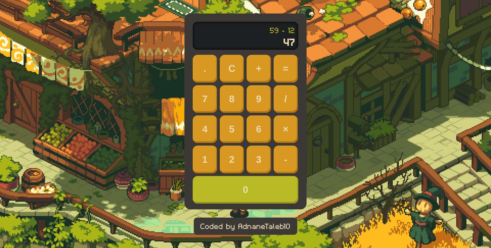

# Odin Calculator

## Project Overview
This project is a simple calculator built using HTML, CSS, and JavaScript. It is part of the foundation section of The Odin Project curriculum.

## Screenshots

## Demo
You can try the live demo of the calculator [here](https://adnanetaleb10.github.io/Odin-Calculator/).